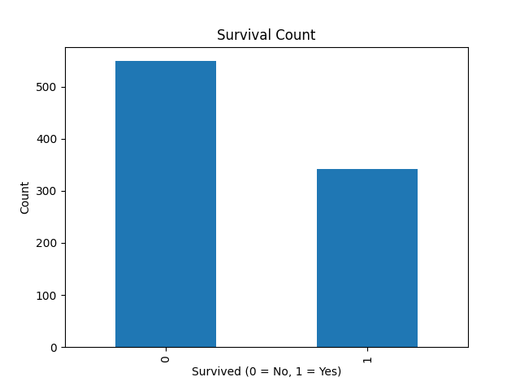

# Machine Learning Data Pipeline

A Python-based end-to-end machine learning pipeline that performs data cleaning, preprocessing, feature engineering, model training, evaluation, and exploratory data analysis (EDA) on real-world data.

---

## Features

* Data loading from raw CSV files
* Data cleaning and preprocessing (handling missing values, dropping irrelevant columns)
* Feature engineering (encoding categorical variables for modeling)
* Model training using Logistic Regression
* Model evaluation using accuracy, precision, and mean squared error (MSE)
* Exploratory Data Analysis (EDA) to understand dataset structure and trends

---
## Example Visualization



## Tech Stack

* Python
* Pandas
* Scikit-learn
* Matplotlib

---

## How It Works

The pipeline processes data in the following steps:

1. Load raw dataset into a Pandas DataFrame
2. Clean and preprocess data (handle missing values, remove unused columns)
3. Perform feature engineering (convert categorical data into numerical format)
4. Train a machine learning model
5. Evaluate model performance using multiple metrics
6. Perform exploratory data analysis to understand patterns and distributions

---

## Project Structure

```
machine-learning-data-pipeline/
├── src/
│   ├── main.py
│   ├── data_loader.py
│   ├── data_preprocessing.py
│   ├── feature_engineering.py
│   ├── model_training.py
│   ├── evaluation.py
│   └── eda.py
├── data/
│   ├── raw/
│   │   └── titanic.csv
│   └── processed/
├── models/
├── reports/
├── notebooks/
├── README.md
├── requirements.txt
└── .gitignore
```

---

## Example Output

```
Model Evaluation:
Accuracy: 0.82
Precision: 0.78
MSE: 0.18
```

---

## Dataset

* Titanic dataset (classification problem predicting passenger survival)

---

## Purpose

This project demonstrates how to build a structured machine learning pipeline that transforms raw data into actionable insights through preprocessing, modeling, and evaluation.

---

## Future Improvements

* Add more advanced models (Random Forest, Gradient Boosting)
* Hyperparameter tuning
* Save trained models to disk
* Add data visualization charts for deeper EDA
* Convert pipeline into a web-based or API-driven application

---
